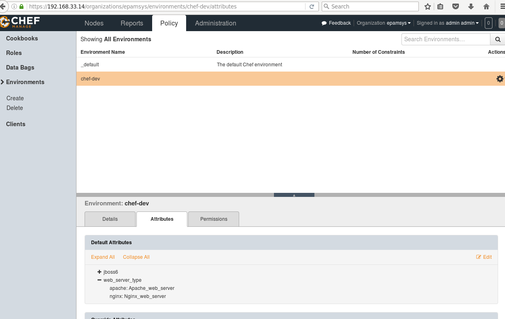
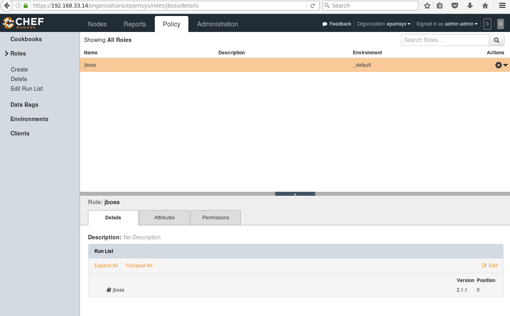
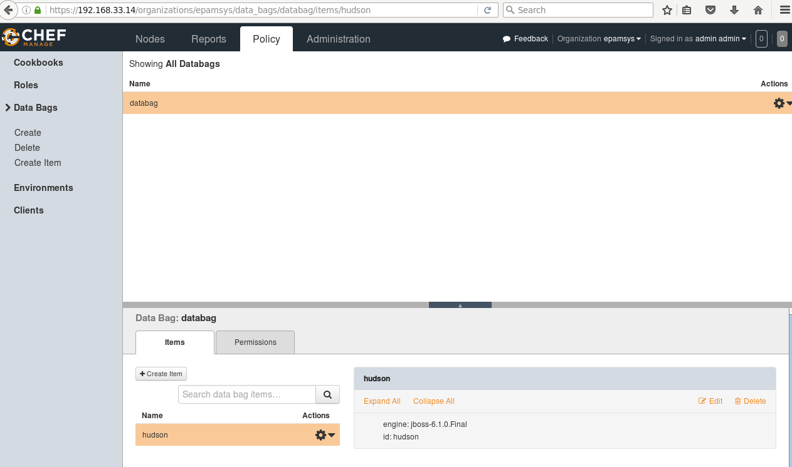
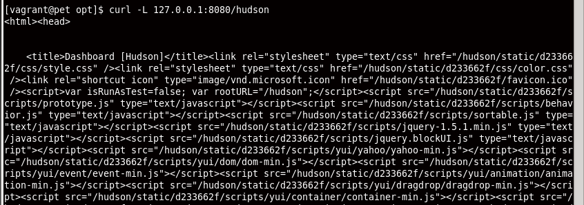
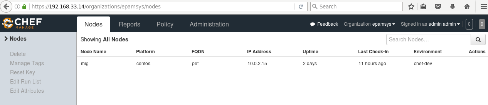

# Task8 by Yauhen Mihura

* <h3>Created environments (chef-dev)</h3>


* <h3>Created Roles(jboss)</h3>


* <h3>Created Data bags (hudson)</h3>



For upload and start i used next commands:
* knife upload cookbooks
* knife bootstrap 192.168.33.13 -x root -P vagrant -r 'role[jboss]' -N mihura -E chef-dev


<h3>Result after start</h3>
*  ```output1.txt``` ([output1.txt](output1.txt))

<h3> Check with curl: </h3>


<h3> Check with nodes at CHef server: <h3>

