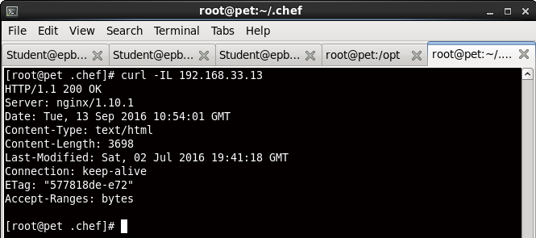
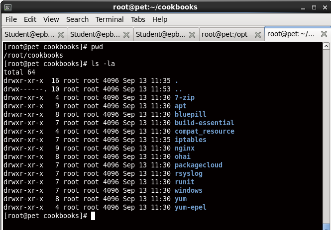

# Task6 by Yauhen Mihura

<h3>Result</h3>
*  ```output.txt``` ([output.txt](output.txt))
* ```runlist.json``` ([runlist.json](runlist.json))
* ```solo.rb``` ([solo.rb](solo.rb))

<h3> Check with curl: <h3>


<h3> Cookbooks: <h3>

